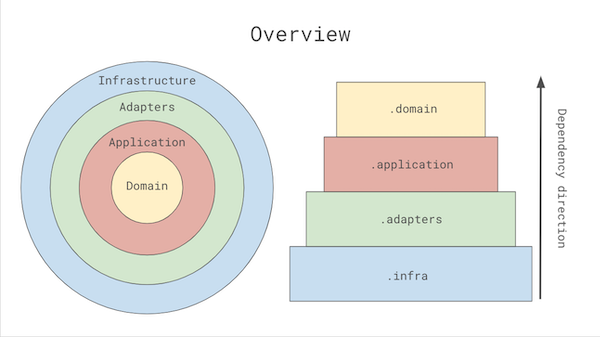

# Todo list with clean architecture - example project


### Architecture overview




The single, most important rule of the clean architecture is [the dependency rule](https://blog.cleancoder.com/uncle-bob/2012/08/13/the-clean-architecture.html):


 >Source code dependencies can only point inwards. Nothing in an inner circle can know anything at all about something in an outer circle. In particular, the name of something declared in an outer circle must not be mentioned by the code in the an inner circle. That includes, functions, classes. variables, or any other named software entity.

In proposed approach, there are four circles. Starting from the higher, most inner one:

#### Domain

The domain layer encapsulates the business logic, rules and processes. 

This is the place where all the tactical DDD building blocks belongs, such as:

* Aggregates
* Entities
* Value objects
* Policies
* Domain services
* Domain events
* Factories

Code in this layer should be technology independent, most preferably written with plain java (or any other language) code. However, the most pragmatic approach is to combine the domain objects with ORM annotations. 


#### Application

Application layer encapsulates the use cases, by orchestrating domain layer and exposing it using well-defined API. It also defines the authorization rules for executing use cases.

Application layer, combined with domain is often reffered as **application core**. The only things application core exposes publicily are ports, which allows to expose two types of aplication features:

* capabilities - all use cases possible to execute, exposed by **inbound ports** (e.g - `CreateTodoList`) - marked as red circles on figure below
* needs - everything needed by application to execute use cases, exposed by **outbound ports** (e.g - `LoadTodoListById`) - marked as grey circles on figure below


Ports can be implemented as well-separated interfaces, build around single capability (use case) or single need. The other approach, which I personally find simpler and more practical is to build a facade around the application, exposing the inbound ports by its public methods. To construct such facade, you need to provide implementation of all outbound adapters, which makes it single object you need to create to be able to run the application code. 

This example project is exposing the ports using facade:


#### Adapters

Adapters layer encapsulates the logic needed to adapt certain infrastructure to application ports. This layer contains code responsible for two things:
* exposing capabilities to the external world - through REST, SOAP, CLI and other interfaces adapters, called **inbound adapters**
* providing tools needed by application - by implementing **outbound adapters** to infrastrucutre

In this project the only inbound adapter needed is the single REST controller - `TodoListController`. Application needs access to clock and persistence, so we have two outbound porst - `MongoTodoListRepository` and anonymous class providing time usingx§ `LocalDateTime::now`.

Thanks to the dependency rule, we can replace any adapter, or add another one with no need to make any change in  the application core. It might get a little more complicated if we decide to combine ORM entities with domain entities (and then change from SQL database to NoSQL database).


#### Infrastructure

Once again, [quoting Uncle Bob](https://blog.cleancoder.com/uncle-bob/2012/08/13/the-clean-architecture.html): 

>The outermost layer is generally composed of frameworks and tools such as the Database, the Web Framework, etc. Generally you don’t write much code in this layer other than glue code that communicates to the next circle inwards.
>
>This layer is where all the details go. The Web is a detail. The database is a detail. We keep these things on the outside where they can do little harm.


### Testing strategy

#### Domain

To test the domain layer, we can go with plain old simple [solitary unit tests](https://martinfowler.com/articles/practical-test-pyramid.html#SociableAndSolitary) :

```java
class TodoItemTest {

    @Test
    void should_mark_todo_item_as_completed() {
        // Given
        TodoItem todoItem = new TodoItem(
                new TodoItemId("todo-item-id"),
                "test the todo",
                LocalDateTime.now().minusSeconds(1)
        );
        LocalDateTime completedAt = LocalDateTime.now();
        todoItem.complete(completedAt);

        // When
        todoItem.complete(completedAt);

        // Then
        todoItem.isCompleted();
    }
}
```


#### Application

When it comes to testing use cases, we should interact with application core in the same way the client does. 

First, we should focus on what the application should do, not how its implemented. To separate the "what" from "how", we can prepare human-readable test scenarios with [Gherkin](https://cucumber.io/docs/gherkin/), and make it executable with [Cucumber](https://cucumber.io/):

```gherkin
Feature: Complete Todo Item

  Scenario: Happy path
    Given I created todo list "Clean arch tech talk"
    And I created todo item "prepare the presentation" on list "Clean arch tech talk"
    When I complete the item "prepare the presentation" from list "Clean arch tech talk"
    Then The item "prepare the presentation" is on the completed section of list "Clean arch tech talk"
    And The item "prepare the presentation" is not on the todo section of list "Clean arch tech talk"
```

We should treat the Cucumber [steps definitions](https://cucumber.io/docs/cucumber/step-definitions/) as inbound adapters, and focus on adapting the [step expression](https://cucumber.io/docs/cucumber/step-definitions/#expressions) to the application facade:

```java
    When("I complete the item {string} from list {string}", 
         (String todoDescription, String todoListTitle) -> {
            errorHandler.executeWithExceptionHandling(() -> {
                CompleteTodoCommand command = new CompleteTodoCommand(
                        new TodoListId(toId(todoListTitle)),
                        new TodoItemId(toId(todoDescription))
                );

                todoListFacade.handle(command);
            });
        });
```

To make test application work, we need to provide the outbound adapters. The easiest way is to simply write them all by yourself as simple in-memory implementations:

```java
public class InMemoryTodoListRepository implements TodoListRepository {

    private final ConcurrentHashMap<TodoListId, TodoList> records = new ConcurrentHashMap<>();

    @Override
    public TodoList loadBy(TodoListId todoListId) throws TodoListNotFoundException {
        if (!records.containsKey(todoListId)) {
            throw new TodoListNotFoundException(todoListId);
        }

        return records.get(todoListId);
    }
  
  // ...
}
```

And inject those implementations to the test application:

```java
public class TestTodoListFacade extends TodoListFacade {
    private final ConfigurableClock configurableClock;

    public TestTodoListFacade() {
        this(
                new InMemoryTodoListRepository(),
                new ConfigurableClock()
        );
    }

    public TestTodoListFacade(TodoListRepository todoListRepository,
                              ConfigurableClock configurableClock) {
        super(todoListRepository, configurableClock);
        this.configurableClock = configurableClock;
    }

    public void setTime(LocalDateTime time) {
        configurableClock.setTime(time);
    }
}
```

By extending the application facade we can ensure that the same code would work on local test environment and production.

To finish the puzzle, we use lightweight application container - [Pico](http://picocontainer.com/) to take care of creating new instance of application for every scenario (no additional code needed) and inject it to Cucumber steps:

```java
public class TodoListSteps implements En {

    public TodoListSteps(TestTodoListFacade todoListFacade,
                         ErrorHandler errorHandler) {
        Given("I created todo list {string}", (String todoListTitle) ->
                errorHandler.executeWithExceptionHandling(() -> {
                    CreateTodoListCommand command = new CreateTodoListCommand(
                            new TodoListId(toId(todoListTitle)),
                            todoListTitle
                    );
                    todoListFacade.handle(command);
                }));
      
      // ... 
    }
}
```

The only thing required by Pico to automatically create instance of component is is no-args constructor, otherwise additional configuration code is needed. Every scenario runs on brand new application and infrastructure. 

It seems a little complicated, but its worth it. With this little effort we get:

- Human-readable specification, well separated from implementation
- Non-fragile tests, nearly as fast as unit tests (hundreds per second)
- Ability to refactor without effort and loosing focus
- BDD framework allowing to focus on scenarios instead of implementation
- Full flexibility on setting up the test environment behaviour.

We should take care of high coverege here, preferably 100% known use cases (and adding new one every time corner case appears).

#### Adapters

The dependency rule makes the application not depend on the adapters layer. Thanks to that, we can test the adapters in isolation.

##### Inbound

The purpose of the inbound adapter is to receive some kind of signal from the infrastructure and adapt it to port exposed by the application (e.g receive HTTP request from REST API and adapt it to facade method call).

What we want to test (and specify) here if the signal is being properly adapted. Such test should take care about contract consistency, so the clients won't get any unexpected changes. I believe the right approach is to execute the same signal being executed on production and verify if the right port has been called (with expected arguments). Thanks to complying with the dependency rule, we can stub whole application without any risk. Furthermore, there is no need to test all the use cases - they are tested on application layer level.

There are tools which help us to minimise the implementation cost:
* spring slice tests - allowing to run spring with limited context (e.g [only the web layer](https://docs.spring.io/spring-boot/docs/2.1.6.RELEASE/reference/html/boot-features-testing.html#boot-features-testing-spring-boot-applications-testing-autoconfigured-mvc-tests)), significantly reducing execution time 
* contract testing framework - responsible for triggering the signal, allowing to define contracts apart from the test code, e.g [pact](https://docs.pact.io/)     


Both tools are used in the example code:  


1. Pact triggers the request defined in interaction description
    ```json
    {
       "description":"A request to create todo list",
       "providerState":"Allowing to create todo list",
       "request":{
          "method":"POST",
          "path":"/todo-lists",
          "body":{
             "id":"test-todo-list-id",
             "name":"Test todo list"
          }
       },
       "response":{
          "status":201
       }
    }
    ```
1. Spring-mvc-slice test context handles it        
    ```java 
    @Provider("TodoListBackend")
    @PactFolder("pacts")
    @WebMvcTest(
            controllers = TodoListController.class,
            excludeAutoConfiguration = {
                    SecurityAutoConfiguration.class
            }
    )
    class ContractTestsRunner {
      
        @Autowired
        private MockMvc mockMvc;
    
        @MockBean
        private TodoListFacade todoListFacade;
    
        @TestTemplate
        @ExtendWith(PactVerificationInvocationContextProvider.class)
        void pactVerification(PactVerificationContext context) {
            context.verifyInteraction();
        }
    
        @BeforeEach
        void before(PactVerificationContext context) {
            context.setTarget(new MockMvcTestTarget(mockMvc));
        }
      
    }
    ```
1. (command case) Pact compares actual response with minimal expected response OR 
    ```java
    @State(value = "Allowing to create todo list", action = StateChangeAction.TEARDOWN)
    void successfulCreateTodoListVerification() {
        CreateTodoListCommand command = new CreateTodoListCommand(TODO_LIST_ID, "Test todo list");
    
        verify(todoListFacade).handle(command);
    }
    ```
1. (query case) Mockito verifies whether the right facade method had been called in expected arguments    
    ```java
    @State(value = "Allowing to get todo list for given id")
    void successfulGetTodoListByIdVerification() {
        TodoItemDto completedItem = new TodoItemDto(
                TODO_ITEM_ID,
                "Clean architecture presentation");
    
        when(todoListFacade.findBy(TODO_LIST_ID)).thenReturn(
                new TodoListDto(
                        TODO_LIST_ID,
                        "Test todo list",
                        Collections.emptyList(),
                        Collections.singletonList(completedItem)
        ));
    }
    ```

In case when we are unable to maintain contract tests using dedicated framework, we should follow the same test flow, and only replace test framework with custom one able to produce the same signal as expected on production. 

Thanks to testing the inbound adapters in isolation and mocking single bean (application facade) the execution time of those tests should

​                                                                                                                  

##### Outbound   

Outbound adapters receives signal from application core, and adapts it to the infrastructure capable of handling such signal.
As in the inbound ports, what we want to test (and specify) here if the signal is being properly adapted. It's even simpler then in the inbound adapters - there is no mocking needed at all, we can test it in complete isolation.


There are tools which help us to minimise the implementation cost:
* spring slice tests - allowing to run spring with limited context (e.g [only the mongoDB-related beans](https://docs.spring.io/spring-boot/docs/2.1.6.RELEASE/reference/html/boot-features-testing.html#boot-features-testing-spring-boot-applications-testing-autoconfigured-mongo-test)), significantly reducing execution time 
* [test containers](https://www.testcontainers.org/)  "providing lightweight, throwaway instances of common databases, Selenium web browsers, or anything else that can run in a Docker container"

To minimise tests execution time, we can create abstract, base class - both spring context and test container would be bootstraped only once, no matter how many test classes would inherit from it. 

The only catch here is not to mock any beans (it shouldn't be needed if the architecture is properly implemented) - such mock would cause spring context refresh.

```java
@Testcontainers
@DataMongoTest
@ContextConfiguration(classes = { TodoSpringApplication.class, MongoConfig.class })
public abstract class MongoRepositoryTest {

    @Rule
    protected static final MongoDBContainer MONGO = SharedTestMongoContainer.getInstance();
  
    // ...
  
}
```

In those tests we should focus on veryfing if adapter works properly, not on a business logic:

```java
public class MongoTodoListRepositoryTest extends MongoRepositoryTest {

    @Autowired
    private MongoTodoListRepository mongoTodoListRepository;

    @Test
    void persisted_object_should_be_equal_to_the_one_before_persist() {
        // given
        TodoListId todoListId = new TodoListId("test-todo-list-id");
        TodoList todoList = TodoList.create(todoListId, "Test todo list");
        mongoTodoListRepository.persist(todoList);

        // when
        TodoList persistedTodoList = mongoTodoListRepository.loadBy(todoListId);

        // then
        assertThat(todoList).isEqualTo(persistedTodoList);
    }

}
```


